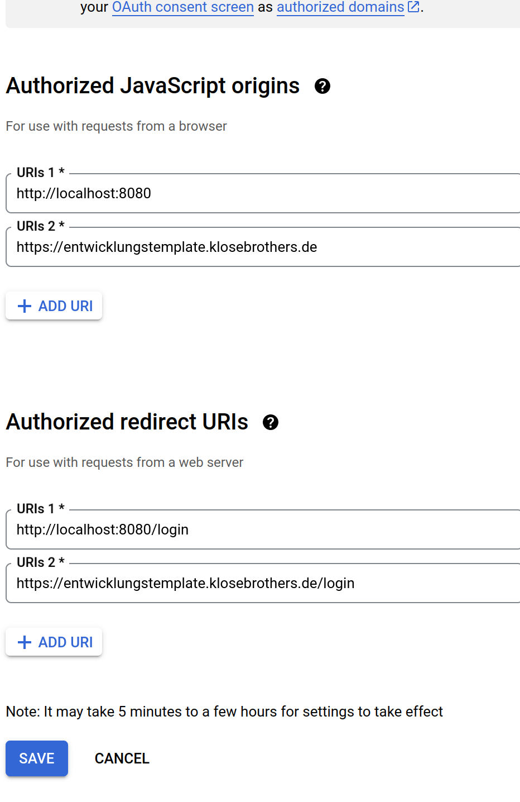
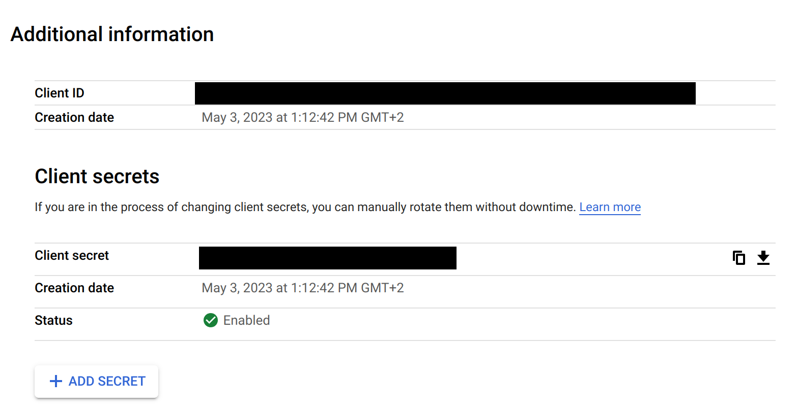
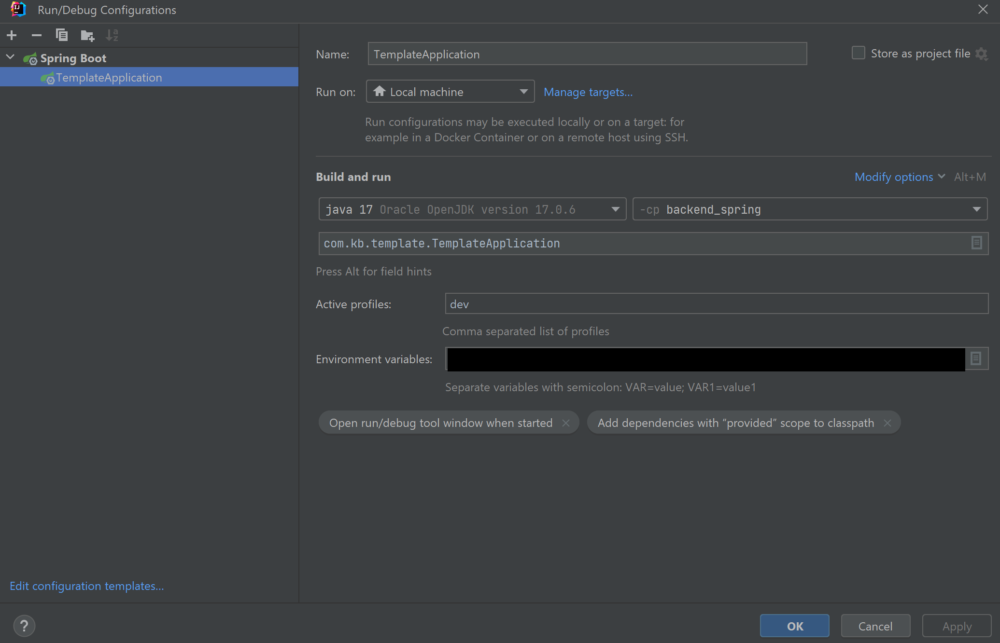

# Entwicklungstemplate
This is a spring and vue template for developers which is configured to be
deployed and checks for vulnerabilities and more.

## Table of Contents
* [Structure](#structure)
* [Setup Project](#setup-project)
  * [Run app with Docker](#run-app-with-docker)
* [Vue Frontend](#vue-frontend)
* [Spring boot Backend](#spring-boot-backend)
* [Liquibase changelog generation](#liquibase-changelog-generation)
* [Deployment](#deployment)
  * [Todos](#todos)
  * [Logs](#logs)
* [Security/Updates](#securityupdates)
  * [Security](#security-owasp-maven-plugin)
  * [Updates](#updates-dependabot)

## Structure

* Spring Boot Java 17 LTS
  * jUnit 5
  * Testcontainer
* Vue js
  * Vite 
  * Cypress
* Sonar Lint
* Es Lint / Prettier
* Kubernetes
* Liquibase
* Maintenance
  * Dependabot
  * Owasp Maven plugin

### Predefined
A User can create his own Configurations with a unique Key and a Value which are stored only for him.
Includes written Unit, Controller, Service and Integration tests for Back- and Frontend. The login is implemented with Google oauth2.

## Setup Project
Click on **Use this template** to create your own Repository with this project as a template.

**Alternative:**
If you have an existing Repository then clone this project and copy it to your repository.
````
git clone https://github.com/klosebrothers/entwicklungstemplate
````

Run [Setup.java](backend_spring/src/main/resources/Setup.java) in (make sure java is installed) to rename all 'entwicklungstemplate' occurrences with your project name
````
java .\Setup.java [name of your project]
````

**Alternative:**
Search for all 'entwicklungstemplate' occurrences and replace with your project name in your IDE.


Builds the front- and backend
````
./mvnw clean install
````

Start Docker Postgresql Database & Liquibase Initcontainer
````
docker compose up
````

Run back- & frontend from backend pom.xml
````
../mvnw spring-boot:run
````

Or run .jar in created target folder 
````
java -jar [FILE.jar]
````

### Run App with Docker

Build Docker App
````
docker build -t dockerfile .
````
Run Application in Docker
````
docker run --network=[PROJECT_NAME]_default -p 8080:8080 -e POSTGRES_URL='jdbc:postgresql://postgresdb:5432/[PROJECT_NAME]' -e APP_USER=postgres -e APP_PASSWORD=postgres -e BASE_URL=http://localhost:5173 dockerfile 
````

## Vue Frontend

See [README](frontend_vue/README.md)

## Spring boot Backend

### oAuth2 Login
This application uses oAuth2 for User Login configured in [configuration](backend_spring/src/main/java/com/kb/template/configuration).

#### Local Dev Quirks
When using local debugging via separately started backend+frontend and running trough vue dev proxy, the redirect url for oauth by convention is set to the real backends port.
Therefore instead of being redirect to the dev proxies url `http://localhost:5173` you will be redirected to `http://localhost:8080` as stated in the oauth configuration in google workspace - therefore can not easily be circumvented
But after login you can easily change back to the aforementioned dev proxy port

#### Requirements
* client-id
* client-secret
* redirect-uri

Example for Google oAuth:

Create authorized js origins and redirect uris for your development and production environments.



Create the client ID and secret.



> **_NOTE:_**Make sure to not expose your client secret!

Set the Client ID, secret and redirect-uri in the [application.dev.properties](backend_spring/src/main/resources/application-dev.properties)
and [application.prod.properties](backend_spring/src/main/resources/application-prod.properties).

You can use environment variables:



> **_NOTE:_**Make sure Environment variables are activated under "Modify Options"

Currently, the redirection base Uri is set to "/login" and the authorization base Uri to "/authorization".
Call "http://localhost:8080/authorization/google" in your browser to authorize with Google. You should be able to
call "http://localhost:8080/api/user/attributes" to get your Google user information when authorized.

### Liquibase changelog generation
Use given command in /backend_spring to generate a changelog from existing and running Database
````
../mvnw liquibase:generateChangeLog 
````

The changelog will be generated in ````src/main/resources/db/changelogs/generated_changelog.xml````.

Make sure to rename this file (recommended name convention db.changelog-[0-9].[0-9].[0-9].xml).

Configuration in [backend pom.xml](backend_spring/pom.xml) see "liquibase-maven-plugin".

All changelogs (+subdirectories with changelog files) in [changelogs folder](backend_spring/src/main/resources/db/changelogs) will 
be included in [master.xml](backend_spring/src/main/resources/db/master.xml) in **alphabetical** order.

## Deployment

### Requirements
* Kubernetes Cluster
* Certificate Manager
* Ingress

### Todos

* Configure a Certificate Manager to automize Authorization to Cluster (**Manifest given** at [cert-manager.yml](k8s/cert-manager.yml))
* Configure ingress Service (**Manifest given** at [ingress.yml](k8s/ingress.yml))
* Talk to someone of the [k8s team](https://klosebrothers.atlassian.net/wiki/spaces/KB/pages/2259583038/Team) 
to apply the cert-manager and ingress manifests to the cluster
* Start CI/CD job manually in GitHub Actions to deploy your Application

### Logs

#### Requirements
* kubectl
  * local .kubeconfig for k8s cluster access (ask the [k8s team](https://klosebrothers.atlassian.net/wiki/spaces/KB/pages/2259583038/Team))
* docker

#### JSON Logging
This Application uses JSON logging which can be configured in the [logback.xml](backend_spring/src/main/resources/logback-spring.xml)
file. The logs are collected and sent to the elastic stack (Configuration in [deploy.yml](k8s/deploy.yml) under annotations).
> **_NOTE:_** Only the production environment uses json logging

#### See Logs on k8s

Get all running pods

````
kubectl get pods
````

Get spring logs from given pod

````
kubectl logs [POD_NAME]
````

Get liquibase logs from pod

````
kubectl logs [POD_NAME] liquibase
````

## Security/Updates

### Security (Owasp Maven Plugin)

Make a dependency check

````
./mvnw org.owasp:dependency-check-maven:check -DfailBuildOnCVSS=8
````

Owasp Maven Plugin checks for Dependency Vulnerabilities (Common Vulnerabilities and Exposures) according to the National 
Vulnerability Database and stores a report in ``backend_spring/target/dependency-check-report.html``. The report can be opened with a browser
to get an overview of all Vulnerabilities and their Base Score (according to the Common Vulnerability Scoring System (CVSS) from 0 to 10).
To suppress a false positive Vulnerability you can get the supress xml code by clicking the **Suppress** button and paste it in the 
 [owasp-suppressions.xml](backend_spring/src/main/resources/owasp-suppressions.xml) file.

Owasp is included in the CI/CD Pipeline and fails the build when a CVSS of 8 or higher is achieved.

#### Suppressions:

* CVE-2021-26291 ([Reference](https://nvd.nist.gov/vuln/detail/CVE-2021-26291)):
Maven Vulnerability for Maven below Version 3.8.1. Make sure to use the maven wrapper or your own Maven 3.8.1+.
* CVE-2022-1471 ([Reference](https://github.com/spring-projects/spring-boot/issues/33457)):
Spring Boot SnakeYaml Vulnerability. Is ignored because of SafeConstructor Extension internally for yaml parsing.


### Updates (Dependabot)

#### Prerequisites:
* Dependabot on GitHub activated (**Settings** **&rarr;** **Code security and analysis**
(If Code security and analysis is not visible ask your GitHub Repository Admin for activation))

Dependabot checks for dependency Updates and creates pull requests in GitHub if any Updates are found.

Configuration in [dependabot.yml](.github/dependabot.yml) 

#### Warning:
* Initial Configuration ignores Java JDK updates
* Some GitHub Actions dependencies are not updated. Check if your Kubernetes Cluster is up-to-date in order
to update the ignored GitHub Actions dependencies